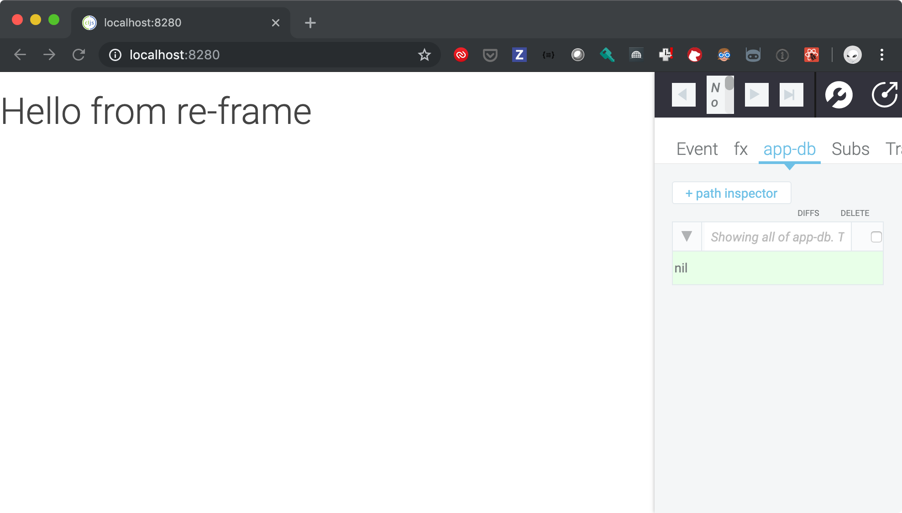
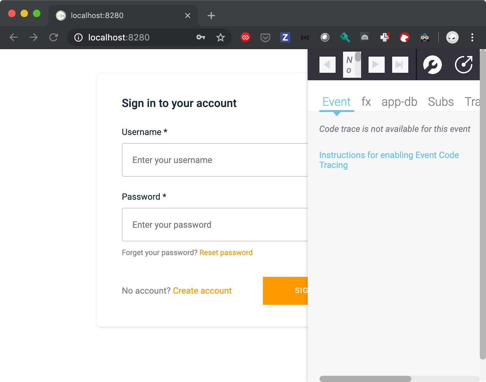

# AWS Amplify Cognito with Clojurescript re-frame application
## Assumptions
* Already installed 
	* An AWS Account that you have administrative access to
	* git
	* Java
	* Node.js and npm
	* Clojure
	* Clojurscript
	* shadow-cljs
	* leiningen
	* Have an editor and know how to use it 
## Initial Setup
```shell
lein new re-frame re-frame-re-com-amplify-exp +10x +cider +re-com +test +garden
cd re-frame-re-com-amplify-exp
lein garden once
git init
```
* Update .gitignore by adding:
```
/resources/public/css/screen.css
.shadow-cljs
node_modules
```
* More setup
```shell
git add -A
git commit -a -m "Initial commit after lein new re-frame re-frame-re-com-amplify-exp +10x +cider +re-com +test +garden"
npm install
git add package-lock.json
git commit -m "package-lock for npm" package-lock.json
lein garden once
lein dev
```
* The `lein dev` probably added more packages for npm and so you should update your git in another shell window in the same directory
```shell
git commit -m "lein updates to package.json" package-lock.json  package.json
```
## Ensure the basics are working
* Go to `http://localhost:8280` in a browser (Chrome is optimal)
* Should look something like:


## Set up AWS Amplify
* You should be in the top level of the `re-frame-re-com-amplify-exp` directory
* __NOTE FOR OMNYWAY FOLKS:__ 
  * Use the credentials for `amplify-laboratory` in the `dev` vault
* Assuming you don’t already have AWS Amplify installed on your dev machine:
```shell
npm install -g @aws-amplify/cli
amplify configure
```

* Follow the instructions as described in [Installing & Configuring the AWS Amplify CLI - YouTube](https://youtu.be/fWbM5DLh25U)to configure you local dev amplify environment to manage your AWS environment
* Initialize the Amplify project.
	* Mostly accept the defaults or as appropriate for you
	* Start command : `lein dev`
	* AWS Profile yes and use the one you created when you did `amplify configure` which by default is `default`
```
> amplify init
Scanning for plugins...
Plugin scan successful
Note: It is recommended to run this command from the root of your app directory
? Enter a name for the project reframerecomamplifye
? Enter a name for the environment dev
? Choose your default editor: Emacs (via Terminal, Mac OS only)
? Choose the type of app that you're building javascript
Please tell us about your project
? What javascript framework are you using react
? Source Directory Path:  src
? Distribution Directory Path: build
? Build Command:  npm run-script build
? Start Command: lein dev
Using default provider  awscloudformation

For more information on AWS Profiles, see:
https://docs.aws.amazon.com/cli/latest/userguide/cli-multiple-profiles.html

? Do you want to use an AWS profile? Yes
? Please choose the profile you want to use default
⠧ Initializing project in the cloud...

CREATE_IN_PROGRESS AuthRole                                AWS::IAM::Role             Fri Oct 04 2019 22:50:40 GMT-0700 (Pacific Daylight Time) Resource creation Initiated
CREATE_IN_PROGRESS DeploymentBucket                        AWS::S3::Bucket            Fri Oct 04 2019 22:50:40 GMT-0700 (Pacific Daylight Time) Resource creation Initiated
CREATE_IN_PROGRESS UnauthRole                              AWS::IAM::Role             Fri Oct 04 2019 22:50:40 GMT-0700 (Pacific Daylight Time) Resource creation Initiated
CREATE_IN_PROGRESS AuthRole                                AWS::IAM::Role             Fri Oct 04 2019 22:50:39 GMT-0700 (Pacific Daylight Time)
CREATE_IN_PROGRESS DeploymentBucket                        AWS::S3::Bucket            Fri Oct 04 2019 22:50:39 GMT-0700 (Pacific Daylight Time)
CREATE_IN_PROGRESS UnauthRole                              AWS::IAM::Role             Fri Oct 04 2019 22:50:39 GMT-0700 (Pacific Daylight Time)
CREATE_IN_PROGRESS reframerecomamplifye-dev-20191004225035 AWS::CloudFormation::Stack Fri Oct 04 2019 22:50:36 GMT-0700 (Pacific Daylight Time) User Initiated
⠴ Initializing project in the cloud...

CREATE_COMPLETE UnauthRole AWS::IAM::Role Fri Oct 04 2019 22:50:52 GMT-0700 (Pacific Daylight Time)
⠏ Initializing project in the cloud...

CREATE_COMPLETE AuthRole AWS::IAM::Role Fri Oct 04 2019 22:50:52 GMT-0700 (Pacific Daylight Time)
⠹ Initializing project in the cloud...

CREATE_COMPLETE DeploymentBucket AWS::S3::Bucket Fri Oct 04 2019 22:51:01 GMT-0700 (Pacific Daylight Time)
⠇ Initializing project in the cloud...

CREATE_COMPLETE reframerecomamplifye-dev-20191004225035 AWS::CloudFormation::Stack Fri Oct 04 2019 22:51:03 GMT-0700 (Pacific Daylight Time)
✔ Successfully created initial AWS cloud resources for deployments.
✔ Initialized provider successfully.
Initialized your environment successfully.

Your project has been successfully initialized and connected to the cloud!
```
* Add the Amplify Authentication service
	* Details at [AWS Amplify Authentication](https://aws-amplify.github.io/docs/js/authentication)
	* Sign-in: Selecting 'Email' and/or 'Phone Number' will allow end users to sign-up using these values.  Selecting 'Username' will require a unique username for users.
```
> amplify add auth
Using service: Cognito, provided by: awscloudformation

 The current configured provider is Amazon Cognito.

 Do you want to use the default authentication and security configuration? Default configuration
 Warning: you will not be able to edit these selections.
 How do you want users to be able to sign in? Email
 Do you want to configure advanced settings? No, I am done.
Successfully added resource reframerecomamplifye16cd456a locally
```
* Push the auth feature / config to AWS
```
> amplify auth push

Current Environment: dev

| Category | Resource name                | Operation | Provider plugin   |
| -------- | ---------------------------- | --------- | ----------------- |
| Auth     | reframerecomamplifye16cd456a | Create    | awscloudformation |
? Are you sure you want to continue? Yes
⠹ Updating resources in the cloud. This may take a few minutes...

CREATE_IN_PROGRESS UpdateRolesWithIDPFunctionRole          AWS::IAM::Role             Fri Oct 04 2019 23:08:01 GMT-0700 (Pacific Daylight Time) Resource creation Initiated
CREATE_IN_PROGRESS authreframerecomamplifye16cd456a        AWS::CloudFormation::Stack Fri Oct 04 2019 23:08:01 GMT-0700 (Pacific Daylight Time) Resource creation Initiated
CREATE_IN_PROGRESS authreframerecomamplifye16cd456a        AWS::CloudFormation::Stack Fri Oct 04 2019 23:08:01 GMT-0700 (Pacific Daylight Time)
CREATE_IN_PROGRESS UpdateRolesWithIDPFunctionRole          AWS::IAM::Role             Fri Oct 04 2019 23:08:00 GMT-0700 (Pacific Daylight Time)
UPDATE_IN_PROGRESS reframerecomamplifye-dev-20191004225035 AWS::CloudFormation::Stack Fri Oct 04 2019 23:07:57 GMT-0700 (Pacific Daylight Time) User Initiated
⠇ Updating resources in the cloud. This may take a few minutes...

CREATE_IN_PROGRESS reframerecomamplifye-dev-20191004225035-authreframerecomamplifye16cd456a-19BSJYQRK36 AWS::CloudFormation::Stack Fri Oct 04 2019 23:08:01 GMT-0700 (Pacific Daylight Time) User Initiated
⠋ Updating resources in the cloud. This may take a few minutes...

CREATE_IN_PROGRESS SNSRole AWS::IAM::Role Fri Oct 04 2019 23:08:08 GMT-0700 (Pacific Daylight Time) Resource creation Initiated
CREATE_IN_PROGRESS SNSRole AWS::IAM::Role Fri Oct 04 2019 23:08:07 GMT-0700 (Pacific Daylight Time)
⠴ Updating resources in the cloud. This may take a few minutes...

CREATE_COMPLETE UpdateRolesWithIDPFunctionRole AWS::IAM::Role Fri Oct 04 2019 23:08:15 GMT-0700 (Pacific Daylight Time)
⠋ Updating resources in the cloud. This may take a few minutes...

CREATE_COMPLETE SNSRole AWS::IAM::Role Fri Oct 04 2019 23:08:20 GMT-0700 (Pacific Daylight Time)
⠙ Updating resources in the cloud. This may take a few minutes...

CREATE_COMPLETE    UserPool AWS::Cognito::UserPool Fri Oct 04 2019 23:08:27 GMT-0700 (Pacific Daylight Time)
CREATE_IN_PROGRESS UserPool AWS::Cognito::UserPool Fri Oct 04 2019 23:08:27 GMT-0700 (Pacific Daylight Time) Resource creation Initiated
CREATE_IN_PROGRESS UserPool AWS::Cognito::UserPool Fri Oct 04 2019 23:08:24 GMT-0700 (Pacific Daylight Time)
⠇ Updating resources in the cloud. This may take a few minutes...

CREATE_COMPLETE    UserPoolClientWeb AWS::Cognito::UserPoolClient Fri Oct 04 2019 23:08:33 GMT-0700 (Pacific Daylight Time)
CREATE_IN_PROGRESS UserPoolClientWeb AWS::Cognito::UserPoolClient Fri Oct 04 2019 23:08:33 GMT-0700 (Pacific Daylight Time) Resource creation Initiated
CREATE_COMPLETE    UserPoolClient    AWS::Cognito::UserPoolClient Fri Oct 04 2019 23:08:33 GMT-0700 (Pacific Daylight Time)
CREATE_IN_PROGRESS UserPoolClient    AWS::Cognito::UserPoolClient Fri Oct 04 2019 23:08:32 GMT-0700 (Pacific Daylight Time) Resource creation Initiated
CREATE_IN_PROGRESS UserPoolClientWeb AWS::Cognito::UserPoolClient Fri Oct 04 2019 23:08:31 GMT-0700 (Pacific Daylight Time)
CREATE_IN_PROGRESS UserPoolClient    AWS::Cognito::UserPoolClient Fri Oct 04 2019 23:08:31 GMT-0700 (Pacific Daylight Time)
⠙ Updating resources in the cloud. This may take a few minutes...

CREATE_IN_PROGRESS UserPoolClientRole AWS::IAM::Role Fri Oct 04 2019 23:08:36 GMT-0700 (Pacific Daylight Time) Resource creation Initiated
CREATE_IN_PROGRESS UserPoolClientRole AWS::IAM::Role Fri Oct 04 2019 23:08:36 GMT-0700 (Pacific Daylight Time)
⠏ Updating resources in the cloud. This may take a few minutes...

CREATE_COMPLETE UserPoolClientRole AWS::IAM::Role Fri Oct 04 2019 23:08:48 GMT-0700 (Pacific Daylight Time)
⠹ Updating resources in the cloud. This may take a few minutes...

CREATE_COMPLETE    UserPoolClientLambda AWS::Lambda::Function Fri Oct 04 2019 23:08:52 GMT-0700 (Pacific Daylight Time)
CREATE_IN_PROGRESS UserPoolClientLambda AWS::Lambda::Function Fri Oct 04 2019 23:08:52 GMT-0700 (Pacific Daylight Time) Resource creation Initiated
CREATE_IN_PROGRESS UserPoolClientLambda AWS::Lambda::Function Fri Oct 04 2019 23:08:52 GMT-0700 (Pacific Daylight Time)
⠸ Updating resources in the cloud. This may take a few minutes...

CREATE_IN_PROGRESS UserPoolClientLambdaPolicy AWS::IAM::Policy Fri Oct 04 2019 23:08:57 GMT-0700 (Pacific Daylight Time) Resource creation Initiated
CREATE_IN_PROGRESS UserPoolClientLambdaPolicy AWS::IAM::Policy Fri Oct 04 2019 23:08:56 GMT-0700 (Pacific Daylight Time)
⠼ Updating resources in the cloud. This may take a few minutes...

CREATE_COMPLETE UserPoolClientLambdaPolicy AWS::IAM::Policy Fri Oct 04 2019 23:09:02 GMT-0700 (Pacific Daylight Time)
⠋ Updating resources in the cloud. This may take a few minutes...

CREATE_IN_PROGRESS UserPoolClientLogPolicy AWS::IAM::Policy Fri Oct 04 2019 23:09:06 GMT-0700 (Pacific Daylight Time)
⠸ Updating resources in the cloud. This may take a few minutes...

CREATE_IN_PROGRESS UserPoolClientLogPolicy AWS::IAM::Policy Fri Oct 04 2019 23:09:06 GMT-0700 (Pacific Daylight Time) Resource creation Initiated
⠸ Updating resources in the cloud. This may take a few minutes...

CREATE_COMPLETE UserPoolClientLogPolicy AWS::IAM::Policy Fri Oct 04 2019 23:09:12 GMT-0700 (Pacific Daylight Time)
⠸ Updating resources in the cloud. This may take a few minutes...

CREATE_IN_PROGRESS UserPoolClientInputs Custom::LambdaCallout Fri Oct 04 2019 23:09:15 GMT-0700 (Pacific Daylight Time)
⠹ Updating resources in the cloud. This may take a few minutes...

CREATE_IN_PROGRESS IdentityPool         AWS::Cognito::IdentityPool Fri Oct 04 2019 23:09:23 GMT-0700 (Pacific Daylight Time)
CREATE_COMPLETE    UserPoolClientInputs Custom::LambdaCallout      Fri Oct 04 2019 23:09:19 GMT-0700 (Pacific Daylight Time)
CREATE_IN_PROGRESS UserPoolClientInputs Custom::LambdaCallout      Fri Oct 04 2019 23:09:19 GMT-0700 (Pacific Daylight Time) Resource creation Initiated
⠼ Updating resources in the cloud. This may take a few minutes...

CREATE_COMPLETE    IdentityPool AWS::Cognito::IdentityPool Fri Oct 04 2019 23:09:25 GMT-0700 (Pacific Daylight Time)
CREATE_IN_PROGRESS IdentityPool AWS::Cognito::IdentityPool Fri Oct 04 2019 23:09:24 GMT-0700 (Pacific Daylight Time) Resource creation Initiated
⠋ Updating resources in the cloud. This may take a few minutes...

CREATE_IN_PROGRESS IdentityPoolRoleMap AWS::Cognito::IdentityPoolRoleAttachment Fri Oct 04 2019 23:09:28 GMT-0700 (Pacific Daylight Time)
⠴ Updating resources in the cloud. This may take a few minutes...

CREATE_COMPLETE    reframerecomamplifye-dev-20191004225035-authreframerecomamplifye16cd456a-19BSJYQRK36 AWS::CloudFormation::Stack               Fri Oct 04 2019 23:09:32 GMT-0700 (Pacific Daylight Time)
CREATE_COMPLETE    IdentityPoolRoleMap                                                                  AWS::Cognito::IdentityPoolRoleAttachment Fri Oct 04 2019 23:09:30 GMT-0700 (Pacific Daylight Time)
CREATE_IN_PROGRESS IdentityPoolRoleMap                                                                  AWS::Cognito::IdentityPoolRoleAttachment Fri Oct 04 2019 23:09:30 GMT-0700 (Pacific Daylight Time) Resource creation Initiated
⠧ Updating resources in the cloud. This may take a few minutes...

CREATE_COMPLETE authreframerecomamplifye16cd456a AWS::CloudFormation::Stack Fri Oct 04 2019 23:09:36 GMT-0700 (Pacific Daylight Time)
⠏ Updating resources in the cloud. This may take a few minutes...

CREATE_IN_PROGRESS UpdateRolesWithIDPFunctionOutputs Custom::LambdaCallout Fri Oct 04 2019 23:09:41 GMT-0700 (Pacific Daylight Time)
CREATE_COMPLETE    UpdateRolesWithIDPFunction        AWS::Lambda::Function Fri Oct 04 2019 23:09:39 GMT-0700 (Pacific Daylight Time)
CREATE_IN_PROGRESS UpdateRolesWithIDPFunction        AWS::Lambda::Function Fri Oct 04 2019 23:09:39 GMT-0700 (Pacific Daylight Time) Resource creation Initiated
CREATE_IN_PROGRESS UpdateRolesWithIDPFunction        AWS::Lambda::Function Fri Oct 04 2019 23:09:38 GMT-0700 (Pacific Daylight Time)
⠹ Updating resources in the cloud. This may take a few minutes...

UPDATE_COMPLETE                     reframerecomamplifye-dev-20191004225035 AWS::CloudFormation::Stack Fri Oct 04 2019 23:09:47 GMT-0700 (Pacific Daylight Time)
UPDATE_COMPLETE_CLEANUP_IN_PROGRESS reframerecomamplifye-dev-20191004225035 AWS::CloudFormation::Stack Fri Oct 04 2019 23:09:47 GMT-0700 (Pacific Daylight Time)
CREATE_COMPLETE                     UpdateRolesWithIDPFunctionOutputs       Custom::LambdaCallout      Fri Oct 04 2019 23:09:45 GMT-0700 (Pacific Daylight Time)
CREATE_IN_PROGRESS                  UpdateRolesWithIDPFunctionOutputs       Custom::LambdaCallout      Fri Oct 04 2019 23:09:44 GMT-0700 (Pacific Daylight Time) Resource creation Initiated
✔ All resources are updated in the cloud
```

* Install the Amplify Node modules we’ll be using for Authentication
```shell
npm add aws-amplify aws-amplify-react
```
* Copy the css for the amplify UI widgets into the proper resource for our app’s css to be picked up
``` shell
cp node_modules/@aws-amplify/ui/dist/style.css resources/public/css/aws-amplify-ui-style.css
```
* Update `resources/public/index.html` to incorporate that css by adding the following line in the `<head>` section
``` html
<link href="css/aws-amplify-ui-style.css" rel="stylesheet" type="text/css">
```

* Get the changes into git
```shell
git add amplify resources/public/css/aws-amplify-ui-style.css
git commit -m "Added and configured Amplify" .gitignore package-lock.json package.json amplify resources/public/index.html resources/public/css
```
* Your application at `http://localhost:8280` should still be running fine assuming you still have the `lein dev` process running
## Update the code to enable the Authenticator
### Edit `src/cljs/re_frame_re_com_amplify_exp/core.cljs`
* Add the following lines to the require block
``` clojure
   ["aws-amplify" :default Amplify :as amp]
   ["aws-amplify-react" :refer (withAuthenticator)]
   ["/aws-exports.js" :default aws-exports]
```
* Add the following def after `dev-setup` function
``` clojure
(def root-view
  (reagent/adapt-react-class
   (withAuthenticator
    (reagent/reactify-component views/main-panel) true)))
```
* Change the function `mount-root` to be:
``` clojure
(defn ^:dev/after-load mount-root []
  (re-frame/clear-subscription-cache!)
  (.configure Amplify aws-exports)
  (re-frame/dispatch-sync [::events/initialize-db])
  (reagent/render [root-view]
                  (.getElementById js/document "app")))
```
* Remove the following line from `init` function:
```clojure
(re-frame/dispatch-sync [::events/initialize-db])
```
* The final file should be:
``` clojure
(ns re-frame-re-com-amplify-exp.core
  (:require
   [reagent.core :as reagent]
   [re-frame.core :as re-frame]
   [re-frame-re-com-amplify-exp.events :as events]
   [re-frame-re-com-amplify-exp.views :as views]
   [re-frame-re-com-amplify-exp.config :as config]
   ["aws-amplify" :default Amplify :as amp]
   ["aws-amplify-react" :refer (withAuthenticator)]
   ["/aws-exports.js" :default aws-exports]
   ))

(defn dev-setup []
  (when config/debug?
    (println "dev mode")))

(def root-view
  (reagent/adapt-react-class
   (withAuthenticator
    (reagent/reactify-component views/main-panel) true)))

(defn ^:dev/after-load mount-root []
  (re-frame/clear-subscription-cache!)
  (.configure Amplify aws-exports)
  (re-frame/dispatch-sync [::events/initialize-db])
  (reagent/render [root-view]
                  (.getElementById js/document "app")))

(defn init []
  (dev-setup)
  (mount-root))
```
* The display should look like this:

* You should click the button on the debugger to have it be in its own window as it will block the “sign-out” button later

* Commit the changes to git
``` shell
git commit -m "App updated to require Cognito Authenticator before any other operation" src/cljs/re_frame_re_com_amplify_exp/core.cljs
```


